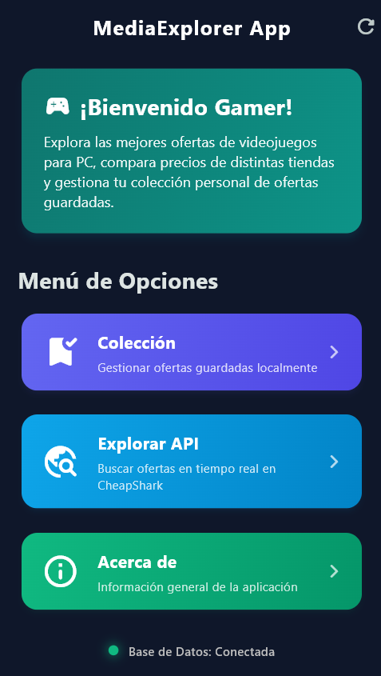
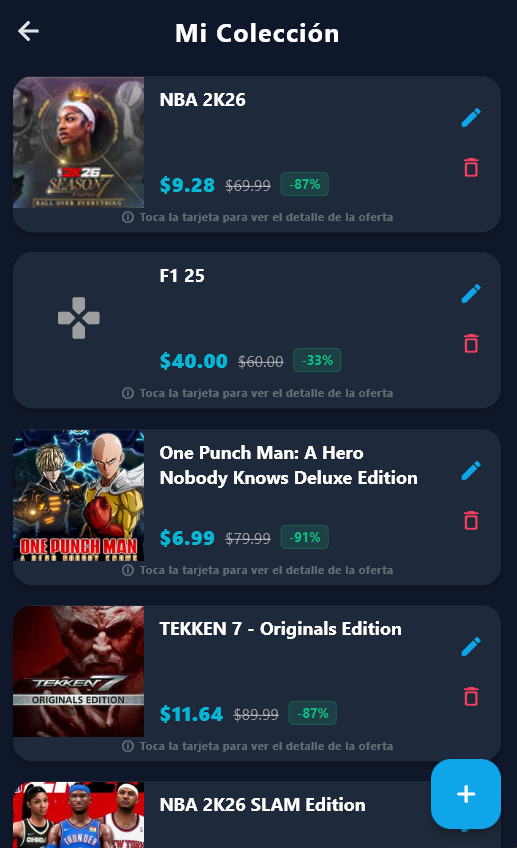
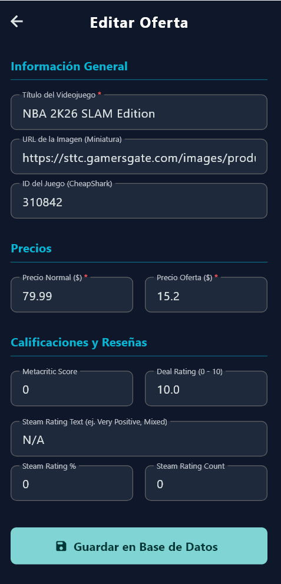
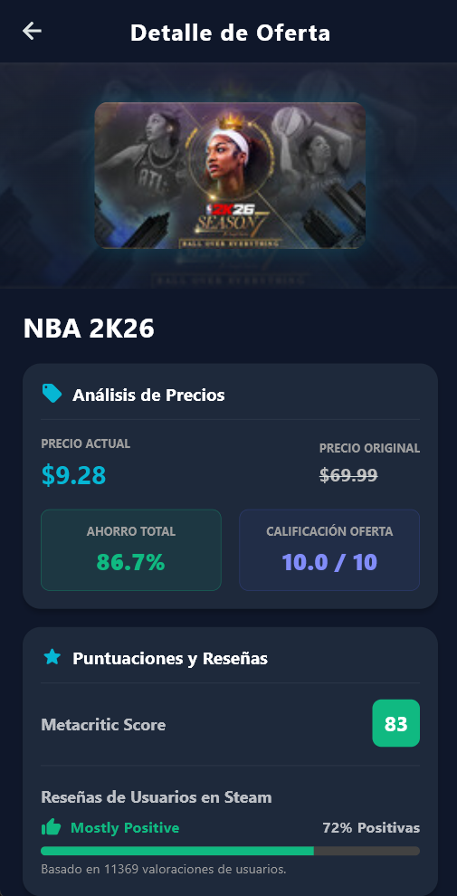
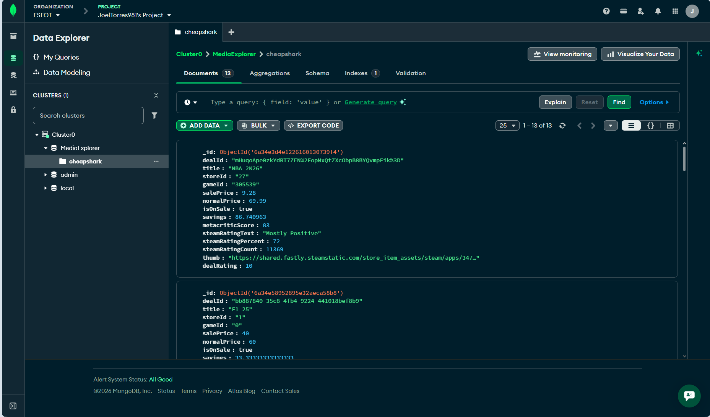

# MediaExplorer App 🎮👾

*   **Integrante:** Joel Torres

---

## 🚀 ¿De qué trata este proyecto?

Este proyecto final de Aplicaciones Móviles presenta **MediaExplorer App**, una aplicación desarrollada en **Flutter** para la consulta y gestión de ofertas de videojuegos de PC. La aplicación realiza dos funciones principales:
1.  Muestra las ofertas más actuales consultando servicios externos en tiempo real.
2.  Permite almacenar las ofertas de interés en una colección personal persistente en la nube mediante **MongoDB Atlas**.


---

## 🔌 API Utilizada: CheapShark

Para la obtención de los datos reales de los videojuegos se consume la API pública y gratuita de **[CheapShark](https://www.cheapshark.com/)**, un agregador que reúne descuentos de múltiples tiendas de distribución digital como Steam, Epic Games, GOG y Humble Store.

*   **Endpoint Utilizado**:  
    `GET https://www.cheapshark.com/api/1.0/deals?pageNumber={page}&pageSize=10`
*   **Lógica de Implementación**:  
    Se estableció un tamaño de página de `10` elementos y se programó un **scroll infinito**. Al deslizarse hacia la parte inferior de la pantalla, la aplicación detecta la proximidad del borde y realiza una consulta automática para cargar los siguientes 10 elementos sin perder fluidez ni rendimiento.

---

## 🛠️ Funcionamiento del CRUD y MongoDB Atlas

La conexión con la base de datos se realiza de forma directa a un clúster en la nube en **MongoDB Atlas** mediante el paquete `mongo_dart`. A continuación se detalla la lógica de cada operación del CRUD:

*   **Create (Crear) ➕**:
    *   **Manual**: Se dispone de un formulario de registro. Para facilitar la entrada de datos, solo el **Título** y los **Precios** (marcados con un asterisco rojo `*`) son obligatorios. Los datos técnicos complementarios son opcionales y el porcentaje de descuento o el estado de la oferta se calculan de manera automática al guardar.
    *   **Guardado Rápido**: Al explorar las ofertas online, las tarjetas de la API cuentan con un botón de guardado. Al presionarlo, la oferta se inserta directamente en MongoDB Atlas, notificando el éxito de la operación mediante un *SnackBar* flotante.
*   **Read (Leer) 📖**:
    *   Los registros de la colección local se consultan desde MongoDB Atlas en lotes paginados de 10 elementos con scroll infinito.
    *   Al presionar sobre una tarjeta, se despliega una pantalla de detalles técnicos con el porcentaje exacto de ahorro, la calificación de Metacritic (coloreada dinámicamente según el puntaje) y la barra de reviews de Steam.
*   **Update (Editar) ✏️**:
    *   Se proporciona un botón de edición en cada elemento de la colección local, el cual abre el formulario con los datos pre-cargados para permitir su modificación y actualización instantánea en la nube.
*   **Delete (Eliminar) 🗑️**:
    *   Para evitar la pérdida accidental de datos, se incorporó un cuadro de diálogo de confirmación (*AlertDialog*). Al confirmar la acción, el elemento se elimina físicamente de la base de datos y la lista se actualiza de manera reactiva.

---

## 📲 Descarga e Instalación Directa (Android APK)

Para probar la aplicación en un dispositivo Android sin necesidad de instalar el SDK de Flutter ni compilar el código, se puede descargar directamente el archivo APK precompilado que se encuentra en este repositorio.

### Pasos para la descarga e instalación:
1.  **Descargar el archivo**:
    *   Ingresar desde el navegador del celular (o PC) a la carpeta del repositorio: [APK/](APK/).
    *   Presionar sobre el archivo [MediaExplorer.apk](APK/MediaExplorer.apk) y hacer clic en el botón de **Download** (Descargar archivo raw) para bajar el archivo de 53.7 MB.
2.  **Instalar en el celular**:
    *   Abrir el archivo APK descargado en el dispositivo Android.
    *   Si el sistema solicita autorización, habilitar el permiso de **"Instalar aplicaciones desconocidas"** para el navegador o el administrador de archivos utilizado.
    *   Presionar en **"Instalar"** y luego abrir la aplicación.
3.  **Ejecutar**:
    *   La aplicación se conectará automáticamente a la API de CheapShark y a la base de datos en la nube de MongoDB Atlas, ya que los accesos están empaquetados dentro de este ejecutable de forma segura.

---

## ⚙️ Instrucciones de Ejecución (Para Desarrollo)

### Requisitos Previos:
*   SDK de **Flutter** instalado.
*   Para ejecutar en **Windows**: Compilador de C++ (Visual Studio Build Tools).
*   Para ejecutar en **Android**: Emulador o dispositivo físico con depuración USB habilitada.

### Pasos para iniciar la App:
1.  Abrir la terminal dentro de la carpeta del proyecto (`TareaCRUD`).
2.  Descargar las dependencias necesarias:
    ```bash
    flutter pub get
    ```
3.  Iniciar la aplicación en la plataforma seleccionada:
    *   **Ejecución en Windows Desktop**:
        ```bash
        flutter run -d windows
        ```
    *   **Ejecución en Android**:
        ```bash
        flutter run -d android
        ```

---

## 📸 Capturas de Pantalla (Galería de la Aplicación)

A continuación se presentan las capturas correspondientes al funcionamiento del sistema y su persistencia en MongoDB Atlas:

### 📱 Pantalla de Inicio
Menú principal estructurado con tarjetas adaptativas que guían en el uso de la aplicación.


### 📁 Sección de Colección Personal (CRUD)
Listado de ofertas guardadas de forma local, detallando precios, porcentaje de ahorro y opciones de edición y eliminación.


### ✍️ Formulario CRUD
Formulario simplificado con los campos requeridos claramente señalizados mediante asteriscos rojos `*`.


### 🔍 Detalles del Videojuego
Visualización detallada de la oferta seleccionada con gráficos y barra de progreso.


### ☁️ Verificación en MongoDB Atlas
Verificación en tiempo real de los documentos y registros guardados exitosamente desde la aplicación en la base de datos remota de MongoDB Atlas.

